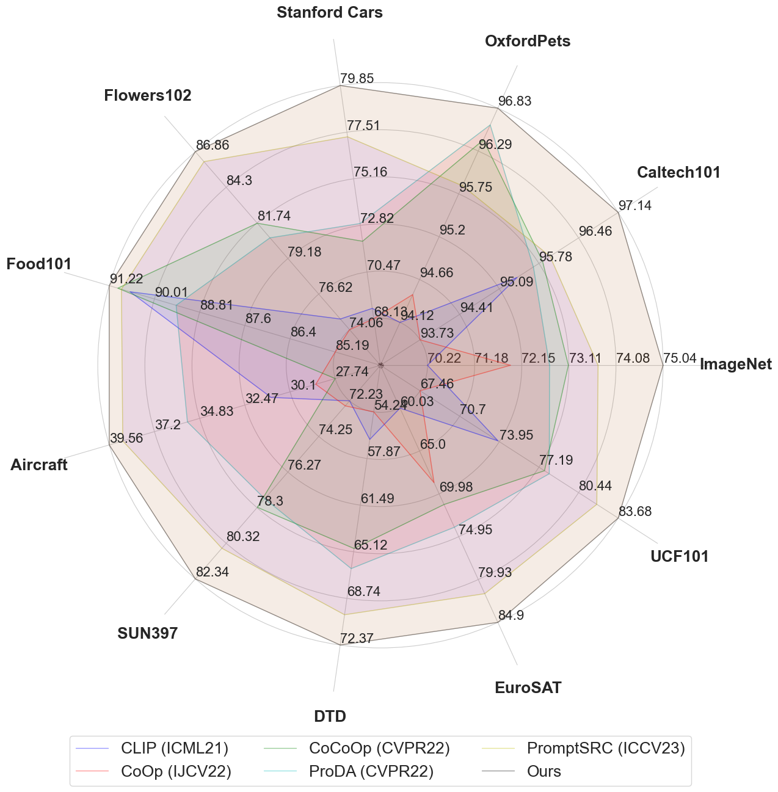

# Beyond Sole Strength: Customized Ensembles for Generalized Vision-Language Models, ICML2024


> Zhihe Lu, Jiawang Bai, Xin Li, Zeyu Xiao, Xinchao Wang


[](https://arxiv.org/pdf/2311.17091.pdf)
[](https://paperswithcode.com/sota/prompt-engineering-on-imagenet)

> **<p align="justify"> Abstract:** *Fine-tuning pre-trained vision-language models (VLMs), e.g., CLIP, for the open-world generalization has gained increasing popularity due to its practical value. However, performance advancements are limited when relying solely on intricate algorithmic designs for a single model, even one exhibiting strong performance, e.g., CLIP-ViTB/16. This paper, for the first time, explores the collaborative potential of leveraging much weaker VLMs to enhance the generalization of a robust single model. The affirmative findings motivate us to address the generalization problem from a novel perspective, i.e., ensemble of pretrained VLMs. We introduce three customized ensemble strategies, each tailored to one specific scenario. Firstly, we introduce the zero-shot ensemble, automatically adjusting the logits of different models based on their confidence when only pre-trained VLMs are available. Furthermore, for scenarios with extra few-shot samples, we propose the training-free and tuning ensemble, offering flexibility based on the availability of computing resources. The proposed ensemble strategies are evaluated on zero-shot, base-tonew, and cross-dataset generalization, achieving new stateof-the-art performance. Notably, this work represents an initial stride toward enhancing the generalization performance of VLMs via ensemble. The code is available publicly.* </p>


## Highlights

<p align="center">
    
</p>

> <p align="justify"> Description of above figure: Comparing existing methods on base-to-new generalization across 11 recognition datasets averaged over 3 seeds. The results indicate that the proposed method outperforms existing arts on 11 diverse datasets, often by large margins. </p>


## Installation 
For installation and other package requirements, please follow the instructions detailed in [INSTALL.md](docs/INSTALL.md). 


## Data Preparation
Please follow the instructions at [DATASETS.md](docs/DATASETS.md) to prepare all datasets.


## Training and Evaluation
Please refer to the [TRAIN.md](docs/TRAIN.md) for detailed instructions on training/running our three ensemble strategies.


## Citation
If you find our work or this repository useful, please consider giving a star :star: and citation.
```bibtex
@inproceedings{lubeyond,
  title={Beyond Sole Strength: Customized Ensembles for Generalized Vision-Language Models},
  author={Lu, Zhihe and Bai, Jiawang and Li, Xin and Xiao, Zeyu and Wang, Xinchao},
  booktitle={Forty-first International Conference on Machine Learning},
  year={2024}
}
```


## Contact
If you have any questions, please create an issue on this repository or contact at zhihelu.academic[at]gmail.com.


## Acknowledgements
Our code is based on [PromptSRC](https://github.com/muzairkhattak/PromptSRC), [MaPLe](https://github.com/muzairkhattak/multimodal-prompt-learning) and [CoCoOp and CoOp](https://github.com/KaiyangZhou/CoOp) repositories. We thank the authors for releasing their code. If you use our code, please consider citing these works as well.

