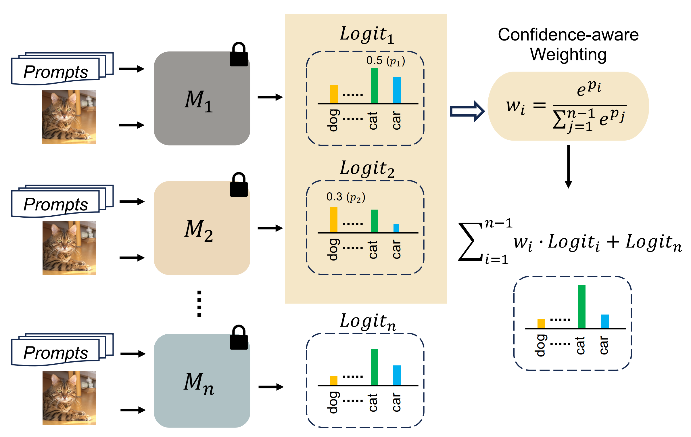

# Customized Ensemble Training

We provide bash scripts in [scripts/](../scripts) for training [zero-shot](../scripts/zs_en/), [training-free](../scripts/trainingfree_en/) and [tuning ensemble](../scripts/tune_en/).
Make sure to update the `DATA` variable with dataset path in the script file and run the commands from the main directory `Ensemble_VLM/`.
Below we provide detailed training and testing instructions.

## Zero-shot Ensemble

<p align="center">
    
</p>


#### Zero-shot set-up
Neither training nor labeled data is required in this set-up. Our zero-shot ensemble (ZS$_{En}$) is an effective way to use multiple VLMs.

Run the commands below for ZS$_{En}$ on ImageNet.

```bash
# Other possible dataset values includes [caltech101, food101, dtd, ucf101, oxford_flowers, oxford_pets, fgvc_aircraft, stanford_cars, sun397, eurosat]

# evaluates on all classes
bash scripts/zs_en/test.sh imagenet gpu

```

## Training-free Ensemble

<p align="center">
    
</p>

#### Base-to-new generalization set-up

Our training-free ensemble (TF$_{En}$) leverages greedy search on base classes to acquire the `relatively` optimal weights for ensemble.

Run the commands below for TF$_{En}$ on ImageNet.

```bash
# Other possible dataset values includes [caltech101, food101, dtd, ucf101, oxford_flowers, oxford_pets, fgvc_aircraft, stanford_cars, sun397, eurosat]

# seed=1
# trains and evaluates on base classes
bash scripts/trainingfree_en/train.sh imagenet 1 gpu
# evaluates on novel classes
bash scripts/trainingfree_en/test.sh imagenet 1 gpu

# seed=2
# trains and evaluates on base classes
bash scripts/trainingfree_en/train.sh imagenet 2 gpu
# evaluates on novel classes
bash scripts/trainingfree_en/test.sh imagenet 2 gpu

# seed=3
# trains and evaluates on base classes
bash scripts/trainingfree_en/train.sh imagenet 3 gpu
# evaluates on novel classes
bash scripts/trainingfree_en/test.sh imagenet 3 gpu
```

#### Averaging results over 3 seeds: 
Once the above trainings and evaluations are completed, the `output/` directory should have the following structure:

```
output
|–– base2new/
|   |–– test_new/
|   |   |–– imagenet/
|   |   |   |–– shots_16/
|   |   |   |   |–– `Trainer name`/
|   |   |   |   |   |–– `Config name`/
|   |   |   |   |   |   |–– seed1/
|   |   |   |   |   |   |–– seed2/
|   |   |   |   |   |   |–– seed3/
|   |–– train_base/
|   |   |–– imagenet/
|   |   |   |–– shots_16/
|   |   |   |   |–– `Trainer name`/
|   |   |   |   |   |–– `Config name`/
|   |   |   |   |   |   |–– seed1/
|   |   |   |   |   |   |–– seed2/
|   |   |   |   |   |   |–– seed3/
```

Now use the script `parse_test_res.py` and run the commands below to calculate the averaged results:
```bash
# prints averaged results for base classes
python output/base2new/train_base/imagenet/shots_16/`Trainer name`/`Config name` --test-log
# averaged results for novel classes
python output/base2new/test_new/imagenet/shots_16/`Trainer name`/`Config name` --test-log
```

The above steps can be repeated for other individual datasets.


## Tuning Ensemble

<p align="center">
    
</p>

#### (1) Base-to-new generalization set-up

Our tuning ensemble (T$_{En}$) generates ensemble weights conditioned on input features.

Run the commands below for T$_{En}$ on ImageNet.

```bash
# Other possible dataset values includes [caltech101, food101, dtd, ucf101, oxford_flowers, oxford_pets, fgvc_aircraft, stanford_cars, sun397, eurosat]

# seed=1
# trains and evaluates on base classes
bash scripts/tune_en/train.sh imagenet 1 gpu
# evaluates on novel classes
bash scripts/tune_en/test.sh imagenet 1 gpu new

# seed=2
# trains and evaluates on base classes
bash scripts/tune_en/train.sh imagenet 2 gpu
# evaluates on novel classes
bash scripts/tune_en/test.sh imagenet 2 gpu new

# seed=3
# trains and evaluates on base classes
bash scripts/tune_en/train.sh imagenet 3 gpu
# evaluates on novel classes
bash scripts/tune_en/test.sh imagenet 3 gpu new
```

Follow the same way as that in training-free ensemble to obtain the averaged results on diverse datasets.


#### (2) Cross-Dataset Transfer setting
We provide instructions to train T$_{En}$ on ImageNet using all 1000 classes with 16 shots and then evaluating it directly on new downstream datasets.
* Firstly, train T$_{En}$ on imagenet in few-shot manner (for all 3 seeds).

```bash
# seed=1 
bash scripts/tune_en/xd_train.sh imagenet 1 gpu
# seed=2 
bash scripts/tune_en/xd_train.sh imagenet 2 gpu
# seed=3 
bash scripts/tune_en/xd_train.sh imagenet 3 gpu
```

* Now directly evaluate the ImageNet trained model on downstream cross-datasets.

```bash
# Other possible dataset values includes [imagenet, food101, dtd, ucf101, oxford_flowers, fgvc_aircraft, sun397, eurosat]

for SEED in 1 2 3
do
    bash scripts/tune_en/xd_test.sh caltech101 ${SEED} gpu
    bash scripts/tune_en/xd_test.sh oxford_pets ${SEED} gpu
    bash scripts/tune_en/xd_test.sh stanford_cars ${SEED} gpu
done
```
You can obtain averaged results by using the script `parse_test_res.py` and following the similar steps as provided in base-to-novel generalization experiments.


## Tuning Ensemble on Baseline Methods
We also provide the code for using our tuning ensemble on two baseline methods, i.e., CoCoOp (CVPR2022) and PromptSRC (ICCV2023).
First, you can follow the instruction in `docs` to train them.
Then run the commands below for CoCoOp + T$_{En}$ on ImageNet.


```bash
# Other possible dataset values includes [caltech101, food101, dtd, ucf101, oxford_flowers, oxford_pets, fgvc_aircraft, stanford_cars, sun397, eurosat]

# seed=1
# trains and evaluates on base classes
bash scripts/baseline_en/train_cocoop.sh imagenet 1 gpu model_dir
# evaluates on novel classes
bash scripts/baseline_en/test_cocoop.sh imagenet 1 gpu new model_dir

# seed=2
# trains and evaluates on base classes
bash scripts/baseline_en/train_cocoop.sh imagenet 2 gpu model_dir
# evaluates on novel classes
bash scripts/baseline_en/test_cocoop.sh imagenet 2 gpu new model_dir

# seed=3
# trains and evaluates on base classes
bash scripts/baseline_en/train_cocoop.sh imagenet 3 gpu model_dir
# evaluates on novel classes
bash scripts/baseline_en/test_cocoop.sh imagenet 3 gpu new model_dir
```

And run the commands below for PromptSRC + T$_{En}$ on ImageNet.

```bash
# Other possible dataset values includes [caltech101, food101, dtd, ucf101, oxford_flowers, oxford_pets, fgvc_aircraft, stanford_cars, sun397, eurosat]

# seed=1
# trains and evaluates on base classes
bash scripts/baseline_en/train_promptsrc.sh imagenet 1 gpu model_dir
# evaluates on novel classes
bash scripts/baseline_en/test_promptsrc.sh imagenet 1 gpu new model_dir

# seed=2
# trains and evaluates on base classes
bash scripts/baseline_en/train_promptsrc.sh imagenet 2 gpu model_dir
# evaluates on novel classes
bash scripts/baseline_en/test_promptsrc.sh imagenet 2 gpu new model_dir

# seed=3
# trains and evaluates on base classes
bash scripts/baseline_en/train_promptsrc.sh imagenet 3 gpu model_dir
# evaluates on novel classes
bash scripts/baseline_en/test_promptsrc.sh imagenet 3 gpu new model_dir
```

You can obtain averaged results by using the script `parse_test_res.py` and following the similar steps as provided above.